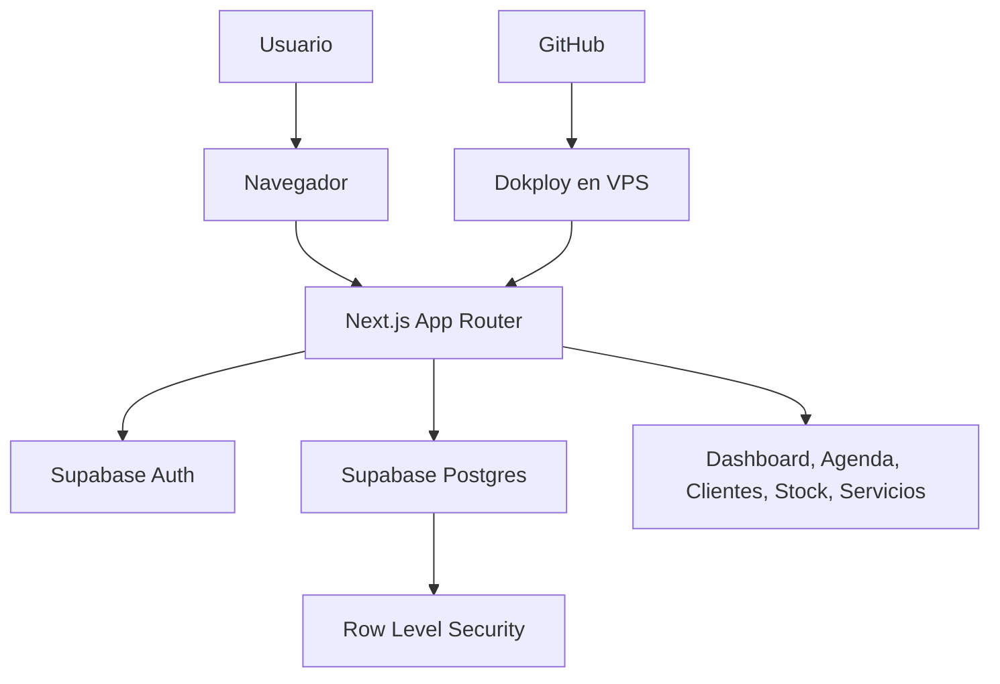
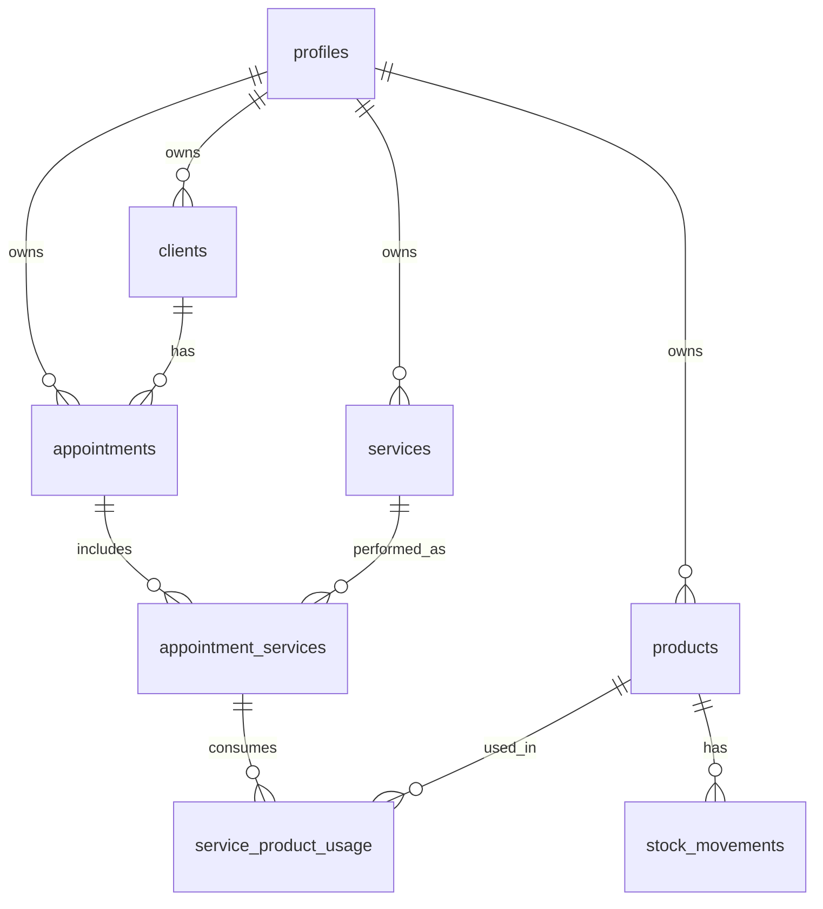

# Plan de desarrollo: App de gestión para peluquería

## 1. Objetivo del sistema

Crear una aplicación web sencilla, segura y escalable para que profesionales o pequeñas peluquerías puedan gestionar:

- Agenda de citas.
- Clientes.
- Servicios prestados.
- Stock de productos.
- Productos consumidos en servicios.
- Tiempo empleado.
- Coste de servicios prestados.
- Dashboard con métricas, gráficas y filtros.

La aplicación debe construirse con **Next.js**, **Tailwind CSS**, **Supabase Postgres**, **Supabase Auth**, **Git/GitHub** y estar preparada para desplegarse en un **VPS usando Dokploy**.

> Nota de alcance: aunque el texto inicial menciona "suscripciones activas", el dominio real del sistema es una peluquería. Por tanto, el modelo de datos se orienta a citas, clientes, servicios, productos, consumo de stock y costes operativos.

---

## 2. Stack técnico recomendado

### Frontend

- **Next.js App Router**.
- **React + TypeScript**.
- **Tailwind CSS**.
- Componentes UI propios o basados en shadcn/ui si se desea acelerar el desarrollo.
- Gráficas con **Recharts**.
- Formularios con **React Hook Form**.
- Validaciones con **Zod**.

### Backend

- Backend integrado en Next.js mediante:
  - Server Components.
  - Server Actions.
  - Route Handlers para endpoints internos si son necesarios.
- Supabase como servicio principal para:
  - Base de datos Postgres.
  - Autenticación.
  - Row Level Security.
  - API de datos.

### Base de datos

- **Supabase Postgres**.
- Políticas RLS por usuario.
- Tablas relacionales normalizadas.
- Índices para búsquedas y filtros.

### Autenticación

- Supabase Auth con email/password.
- Sesiones SSR con `@supabase/ssr`.
- Protección de rutas privadas desde middleware/proxy de Next.js.
- Cada usuario solo podrá ver y modificar sus propios registros.

### Despliegue

- Repositorio en GitHub.
- VPS con Dokploy.
- Despliegue recomendado:
  - Opción A: aplicación Next.js desde GitHub usando build de Dokploy.
  - Opción B: Dockerfile propio para mayor control.
- Supabase alojado externamente en Supabase Cloud.

---

## 3. Arquitectura general



### Principios de arquitectura

- La aplicación será **multiusuario**, no multitenant complejo.
- Cada registro tendrá `user_id`.
- Las políticas RLS impedirán acceso cruzado entre usuarios.
- El cálculo de costes se podrá hacer:
  - En consultas SQL/vistas para métricas.
  - En Server Actions para operaciones de negocio.
  - En el cliente solo para visualización secundaria.
- El frontend no debe recibir claves privadas de Supabase.
- Las variables públicas deben usar prefijo `NEXT_PUBLIC_`; las privadas no.

---

## 4. Módulos funcionales

### 4.1 Autenticación

Pantallas:

- `/login`
- `/registro`
- `/recuperar-password`
- `/actualizar-password`

Funciones:

- Registro con email y contraseña.
- Login.
- Logout.
- Recuperación de contraseña.
- Redirección automática:
  - Usuario no autenticado intentando entrar a `/app/*` -> `/login`.
  - Usuario autenticado entrando a `/login` o `/registro` -> `/app/dashboard`.

### 4.2 Dashboard

Ruta:

- `/app/dashboard`

Debe mostrar:

- Coste total de servicios prestados.
- Ingresos estimados por servicios.
- Margen estimado.
- Número de citas del periodo.
- Horas trabajadas.
- Productos más consumidos.
- Servicios más frecuentes.
- Stock bajo.
- Citas próximas.

Filtros:

- Rango de fechas.
- Cliente.
- Servicio.
- Estado de cita.
- Producto.

Gráficas recomendadas:

- Coste por mes.
- Ingresos por mes.
- Servicios por categoría.
- Consumo de productos.
- Horas trabajadas por periodo.

### 4.3 Agenda de citas

Ruta:

- `/app/agenda`

Funciones:

- Crear cita.
- Editar cita.
- Eliminar cita.
- Cambiar estado.
- Ver citas en tabla y vista tipo calendario simple.

Estados recomendados:

- `scheduled`: programada.
- `completed`: completada.
- `cancelled`: cancelada.
- `no_show`: no asistió.

Campos visibles:

- Cliente.
- Fecha y hora de inicio.
- Fecha y hora de fin.
- Servicios asociados.
- Estado.
- Notas.
- Coste estimado.
- Precio cobrado.

### 4.4 Clientes

Ruta:

- `/app/clientes`

Funciones:

- Alta de cliente.
- Edición.
- Eliminación.
- Historial de citas.
- Historial de servicios.

Campos recomendados:

- Nombre.
- Teléfono.
- Email.
- Fecha de nacimiento.
- Notas.
- Preferencias.
- Alergias o advertencias.

### 4.5 Servicios

Ruta:

- `/app/servicios`

Funciones:

- Crear catálogo de servicios.
- Editar precio base.
- Editar duración estimada.
- Activar/desactivar servicios.

Ejemplos:

- Corte.
- Tinte.
- Peinado.
- Barba.
- Tratamiento capilar.

Campos:

- Nombre.
- Categoría.
- Precio base.
- Duración estimada.
- Coste de mano de obra estimado.
- Descripción.
- Estado activo/inactivo.

### 4.6 Stock de productos

Ruta:

- `/app/productos`

Funciones:

- Crear producto.
- Editar stock.
- Registrar entradas de stock.
- Registrar ajustes.
- Ver productos con stock bajo.

Campos:

- Nombre.
- Marca.
- Categoría.
- Unidad de medida.
- Coste unitario.
- Stock actual.
- Stock mínimo.
- Proveedor.
- SKU opcional.

### 4.7 Servicios prestados y consumo de productos

Ruta:

- `/app/servicios-prestados`

Este módulo une citas, servicios y productos realmente utilizados.

Funciones:

- Registrar qué servicios se hicieron en una cita.
- Registrar productos consumidos.
- Calcular coste real del servicio.
- Calcular margen.
- Descontar stock cuando se confirma el consumo.

Coste de servicio prestado:

```text
coste_total = coste_productos_consumidos + coste_mano_obra
ingreso_total = precio_cobrado
margen = ingreso_total - coste_total
```

Coste de mano de obra:

```text
coste_mano_obra = minutos_empleados / 60 * coste_hora_usuario
```

El coste/hora puede guardarse en el perfil del usuario.

---

## 5. Estructura de proyecto

```text
peluqueria-app/
  app/
    (auth)/
      login/
        page.tsx
      registro/
        page.tsx
      recuperar-password/
        page.tsx
      actualizar-password/
        page.tsx
    app/
      layout.tsx
      dashboard/
        page.tsx
      agenda/
        page.tsx
      clientes/
        page.tsx
      productos/
        page.tsx
      servicios/
        page.tsx
      servicios-prestados/
        page.tsx
      ajustes/
        page.tsx
    api/
      health/
        route.ts
    layout.tsx
    page.tsx
    globals.css
  components/
    auth/
    dashboard/
    agenda/
    clientes/
    productos/
    servicios/
    shared/
      app-sidebar.tsx
      topbar.tsx
      data-table.tsx
      empty-state.tsx
      confirm-dialog.tsx
      date-range-filter.tsx
  lib/
    supabase/
      client.ts
      server.ts
      middleware.ts
    validations/
      cliente.schema.ts
      producto.schema.ts
      servicio.schema.ts
      cita.schema.ts
    formatters.ts
    dates.ts
    costs.ts
  actions/
    clientes.actions.ts
    productos.actions.ts
    servicios.actions.ts
    citas.actions.ts
    servicios-prestados.actions.ts
    dashboard.actions.ts
  types/
    database.types.ts
    domain.types.ts
  supabase/
    migrations/
      0001_initial_schema.sql
    seed.sql
  public/
  middleware.ts
  next.config.ts
  tailwind.config.ts
  package.json
  Dockerfile
  docker-compose.yml
  .env.example
  README.md
```

---

## 6. Rutas de la aplicación

### Rutas públicas

| Ruta | Descripción |
|---|---|
| `/` | Redirige según sesión: dashboard o login |
| `/login` | Inicio de sesión |
| `/registro` | Registro |
| `/recuperar-password` | Solicitud de recuperación |
| `/actualizar-password` | Cambio de contraseña |

### Rutas privadas

| Ruta | Descripción |
|---|---|
| `/app/dashboard` | Panel general |
| `/app/agenda` | Gestión de citas |
| `/app/clientes` | Gestión de clientes |
| `/app/productos` | Gestión de stock |
| `/app/servicios` | Catálogo de servicios |
| `/app/servicios-prestados` | Registro de servicios realizados |
| `/app/ajustes` | Perfil, coste/hora, preferencias |

---

## 7. Diseño UI/UX

### Estilo visual

- Interfaz limpia, profesional y clara.
- Paleta sugerida:
  - Fondo: `#F8FAFC`.
  - Texto principal: `#111827`.
  - Primario: `#0F766E`.
  - Secundario: `#2563EB`.
  - Éxito: `#16A34A`.
  - Advertencia: `#D97706`.
  - Error: `#DC2626`.
- Bordes suaves con radio máximo de `8px`.
- Tablas compactas y legibles.
- Formularios en modales o paneles laterales según complejidad.

### Layout privado

- Sidebar izquierda:
  - Dashboard.
  - Agenda.
  - Clientes.
  - Servicios.
  - Productos.
  - Servicios prestados.
  - Ajustes.
- Topbar:
  - Nombre del usuario.
  - Botón de logout.
  - Accesos rápidos.
- Contenido:
  - Filtros arriba.
  - Métricas o tabla debajo.

### Componentes comunes

- `DataTable`.
- `DateRangeFilter`.
- `SearchInput`.
- `StatusBadge`.
- `MetricCard`.
- `ChartCard`.
- `ConfirmDialog`.
- `FormDrawer`.
- `EmptyState`.
- `LoadingSkeleton`.

---

## 8. Modelo de datos

### Entidades principales

- `profiles`: perfil del usuario.
- `clients`: clientes de cada usuario.
- `services`: catálogo de servicios.
- `products`: productos de stock.
- `appointments`: citas de agenda.
- `appointment_services`: servicios incluidos en una cita.
- `service_product_usage`: productos consumidos por servicio prestado.
- `stock_movements`: entradas, salidas y ajustes de stock.
- `time_entries`: tiempo empleado si se quiere registrar de forma más granular.

### Relaciones principales



---

## 9. SQL completo para Supabase

El siguiente SQL debe ejecutarse en el SQL Editor de Supabase o guardarse como migración en `supabase/migrations/0001_initial_schema.sql`.

```sql
-- Enable extensions
create extension if not exists "pgcrypto";

-- =========================
-- ENUMS
-- =========================

do $$
begin
  if not exists (select 1 from pg_type where typname = 'appointment_status') then
    create type appointment_status as enum ('scheduled', 'completed', 'cancelled', 'no_show');
  end if;

  if not exists (select 1 from pg_type where typname = 'stock_movement_type') then
    create type stock_movement_type as enum ('purchase', 'usage', 'adjustment', 'return', 'waste');
  end if;
end $$;

-- =========================
-- UPDATED_AT TRIGGER
-- =========================

create or replace function public.set_updated_at()
returns trigger
language plpgsql
as $$
begin
  new.updated_at = now();
  return new;
end;
$$;

-- =========================
-- PROFILES
-- =========================

create table if not exists public.profiles (
  id uuid primary key references auth.users(id) on delete cascade,
  full_name text,
  business_name text,
  phone text,
  hourly_cost numeric(12,2) not null default 0 check (hourly_cost >= 0),
  currency text not null default 'EUR',
  locale text not null default 'es-ES',
  created_at timestamptz not null default now(),
  updated_at timestamptz not null default now()
);

create trigger set_profiles_updated_at
before update on public.profiles
for each row execute function public.set_updated_at();

create or replace function public.handle_new_user()
returns trigger
language plpgsql
security definer
set search_path = public
as $$
begin
  insert into public.profiles (id, full_name)
  values (new.id, coalesce(new.raw_user_meta_data->>'full_name', ''))
  on conflict (id) do nothing;
  return new;
end;
$$;

drop trigger if exists on_auth_user_created on auth.users;

create trigger on_auth_user_created
after insert on auth.users
for each row execute function public.handle_new_user();

-- =========================
-- CLIENTS
-- =========================

create table if not exists public.clients (
  id uuid primary key default gen_random_uuid(),
  user_id uuid not null references auth.users(id) on delete cascade,
  full_name text not null,
  phone text,
  email text,
  birth_date date,
  notes text,
  preferences text,
  alerts text,
  created_at timestamptz not null default now(),
  updated_at timestamptz not null default now()
);

create index if not exists clients_user_id_idx on public.clients(user_id);
create index if not exists clients_user_name_idx on public.clients(user_id, full_name);
create index if not exists clients_user_phone_idx on public.clients(user_id, phone);

create trigger set_clients_updated_at
before update on public.clients
for each row execute function public.set_updated_at();

-- =========================
-- SERVICES
-- =========================

create table if not exists public.services (
  id uuid primary key default gen_random_uuid(),
  user_id uuid not null references auth.users(id) on delete cascade,
  name text not null,
  category text,
  description text,
  base_price numeric(12,2) not null default 0 check (base_price >= 0),
  estimated_minutes integer not null default 30 check (estimated_minutes > 0),
  estimated_labor_cost numeric(12,2) not null default 0 check (estimated_labor_cost >= 0),
  is_active boolean not null default true,
  created_at timestamptz not null default now(),
  updated_at timestamptz not null default now()
);

create index if not exists services_user_id_idx on public.services(user_id);
create index if not exists services_user_active_idx on public.services(user_id, is_active);
create index if not exists services_user_category_idx on public.services(user_id, category);

create trigger set_services_updated_at
before update on public.services
for each row execute function public.set_updated_at();

-- =========================
-- PRODUCTS
-- =========================

create table if not exists public.products (
  id uuid primary key default gen_random_uuid(),
  user_id uuid not null references auth.users(id) on delete cascade,
  name text not null,
  brand text,
  category text,
  sku text,
  unit text not null default 'ml',
  unit_cost numeric(12,4) not null default 0 check (unit_cost >= 0),
  current_stock numeric(12,3) not null default 0 check (current_stock >= 0),
  minimum_stock numeric(12,3) not null default 0 check (minimum_stock >= 0),
  supplier text,
  is_active boolean not null default true,
  created_at timestamptz not null default now(),
  updated_at timestamptz not null default now()
);

create index if not exists products_user_id_idx on public.products(user_id);
create index if not exists products_user_name_idx on public.products(user_id, name);
create index if not exists products_user_low_stock_idx on public.products(user_id, current_stock, minimum_stock);
create unique index if not exists products_user_sku_unique_idx
on public.products(user_id, sku)
where sku is not null;

create trigger set_products_updated_at
before update on public.products
for each row execute function public.set_updated_at();

-- =========================
-- APPOINTMENTS
-- =========================

create table if not exists public.appointments (
  id uuid primary key default gen_random_uuid(),
  user_id uuid not null references auth.users(id) on delete cascade,
  client_id uuid references public.clients(id) on delete set null,
  starts_at timestamptz not null,
  ends_at timestamptz not null,
  status appointment_status not null default 'scheduled',
  title text,
  notes text,
  total_price numeric(12,2) not null default 0 check (total_price >= 0),
  total_cost numeric(12,2) not null default 0 check (total_cost >= 0),
  created_at timestamptz not null default now(),
  updated_at timestamptz not null default now(),
  constraint appointments_valid_time check (ends_at > starts_at)
);

create index if not exists appointments_user_id_idx on public.appointments(user_id);
create index if not exists appointments_user_starts_at_idx on public.appointments(user_id, starts_at);
create index if not exists appointments_user_status_idx on public.appointments(user_id, status);
create index if not exists appointments_client_id_idx on public.appointments(client_id);

create trigger set_appointments_updated_at
before update on public.appointments
for each row execute function public.set_updated_at();

-- =========================
-- APPOINTMENT SERVICES
-- =========================

create table if not exists public.appointment_services (
  id uuid primary key default gen_random_uuid(),
  user_id uuid not null references auth.users(id) on delete cascade,
  appointment_id uuid not null references public.appointments(id) on delete cascade,
  service_id uuid references public.services(id) on delete set null,
  service_name text not null,
  price_charged numeric(12,2) not null default 0 check (price_charged >= 0),
  minutes_spent integer not null default 0 check (minutes_spent >= 0),
  labor_cost numeric(12,2) not null default 0 check (labor_cost >= 0),
  product_cost numeric(12,2) not null default 0 check (product_cost >= 0),
  total_cost numeric(12,2) generated always as (labor_cost + product_cost) stored,
  notes text,
  created_at timestamptz not null default now(),
  updated_at timestamptz not null default now()
);

create index if not exists appointment_services_user_id_idx on public.appointment_services(user_id);
create index if not exists appointment_services_appointment_id_idx on public.appointment_services(appointment_id);
create index if not exists appointment_services_service_id_idx on public.appointment_services(service_id);

create trigger set_appointment_services_updated_at
before update on public.appointment_services
for each row execute function public.set_updated_at();

-- =========================
-- SERVICE PRODUCT USAGE
-- =========================

create table if not exists public.service_product_usage (
  id uuid primary key default gen_random_uuid(),
  user_id uuid not null references auth.users(id) on delete cascade,
  appointment_service_id uuid not null references public.appointment_services(id) on delete cascade,
  product_id uuid references public.products(id) on delete set null,
  product_name text not null,
  quantity_used numeric(12,3) not null check (quantity_used > 0),
  unit text not null,
  unit_cost_at_usage numeric(12,4) not null default 0 check (unit_cost_at_usage >= 0),
  total_cost numeric(12,2) generated always as (round((quantity_used * unit_cost_at_usage)::numeric, 2)) stored,
  created_at timestamptz not null default now()
);

create index if not exists service_product_usage_user_id_idx on public.service_product_usage(user_id);
create index if not exists service_product_usage_appointment_service_id_idx on public.service_product_usage(appointment_service_id);
create index if not exists service_product_usage_product_id_idx on public.service_product_usage(product_id);

-- =========================
-- STOCK MOVEMENTS
-- =========================

create table if not exists public.stock_movements (
  id uuid primary key default gen_random_uuid(),
  user_id uuid not null references auth.users(id) on delete cascade,
  product_id uuid not null references public.products(id) on delete cascade,
  movement_type stock_movement_type not null,
  quantity numeric(12,3) not null check (quantity > 0),
  unit_cost numeric(12,4) check (unit_cost is null or unit_cost >= 0),
  reference text,
  notes text,
  created_at timestamptz not null default now()
);

create index if not exists stock_movements_user_id_idx on public.stock_movements(user_id);
create index if not exists stock_movements_product_id_idx on public.stock_movements(product_id);
create index if not exists stock_movements_user_created_at_idx on public.stock_movements(user_id, created_at);

-- =========================
-- TIME ENTRIES
-- =========================

create table if not exists public.time_entries (
  id uuid primary key default gen_random_uuid(),
  user_id uuid not null references auth.users(id) on delete cascade,
  appointment_id uuid references public.appointments(id) on delete cascade,
  appointment_service_id uuid references public.appointment_services(id) on delete cascade,
  description text,
  minutes_spent integer not null check (minutes_spent > 0),
  hourly_cost numeric(12,2) not null default 0 check (hourly_cost >= 0),
  total_cost numeric(12,2) generated always as (round(((minutes_spent::numeric / 60) * hourly_cost)::numeric, 2)) stored,
  entry_date date not null default current_date,
  created_at timestamptz not null default now()
);

create index if not exists time_entries_user_id_idx on public.time_entries(user_id);
create index if not exists time_entries_user_entry_date_idx on public.time_entries(user_id, entry_date);

-- =========================
-- HELPER FUNCTIONS
-- =========================

create or replace function public.recalculate_appointment_service_cost(target_id uuid)
returns void
language plpgsql
security definer
set search_path = public
as $$
declare
  usage_total numeric(12,2);
begin
  select coalesce(sum(total_cost), 0)
  into usage_total
  from public.service_product_usage
  where appointment_service_id = target_id;

  update public.appointment_services
  set product_cost = usage_total,
      updated_at = now()
  where id = target_id;
end;
$$;

create or replace function public.recalculate_appointment_totals(target_id uuid)
returns void
language plpgsql
security definer
set search_path = public
as $$
begin
  update public.appointments
  set total_price = coalesce((
        select sum(price_charged)
        from public.appointment_services
        where appointment_id = target_id
      ), 0),
      total_cost = coalesce((
        select sum(total_cost)
        from public.appointment_services
        where appointment_id = target_id
      ), 0),
      updated_at = now()
  where id = target_id;
end;
$$;

-- =========================
-- DASHBOARD VIEW
-- =========================

create or replace view public.dashboard_service_summary as
select
  a.user_id,
  date_trunc('month', a.starts_at)::date as month,
  count(distinct a.id) as appointments_count,
  coalesce(sum(aps.price_charged), 0) as revenue,
  coalesce(sum(aps.total_cost), 0) as cost,
  coalesce(sum(aps.price_charged - aps.total_cost), 0) as margin,
  coalesce(sum(aps.minutes_spent), 0) as minutes_spent
from public.appointments a
left join public.appointment_services aps on aps.appointment_id = a.id
where a.status = 'completed'
group by a.user_id, date_trunc('month', a.starts_at)::date;

-- =========================
-- ROW LEVEL SECURITY
-- =========================

alter table public.profiles enable row level security;
alter table public.clients enable row level security;
alter table public.services enable row level security;
alter table public.products enable row level security;
alter table public.appointments enable row level security;
alter table public.appointment_services enable row level security;
alter table public.service_product_usage enable row level security;
alter table public.stock_movements enable row level security;
alter table public.time_entries enable row level security;

-- Profiles
create policy "Users can view own profile"
on public.profiles for select
using (auth.uid() = id);

create policy "Users can update own profile"
on public.profiles for update
using (auth.uid() = id)
with check (auth.uid() = id);

-- Generic user-owned policies
create policy "Users can manage own clients"
on public.clients for all
using (auth.uid() = user_id)
with check (auth.uid() = user_id);

create policy "Users can manage own services"
on public.services for all
using (auth.uid() = user_id)
with check (auth.uid() = user_id);

create policy "Users can manage own products"
on public.products for all
using (auth.uid() = user_id)
with check (auth.uid() = user_id);

create policy "Users can manage own appointments"
on public.appointments for all
using (auth.uid() = user_id)
with check (auth.uid() = user_id);

create policy "Users can manage own appointment services"
on public.appointment_services for all
using (auth.uid() = user_id)
with check (auth.uid() = user_id);

create policy "Users can manage own product usage"
on public.service_product_usage for all
using (auth.uid() = user_id)
with check (auth.uid() = user_id);

create policy "Users can manage own stock movements"
on public.stock_movements for all
using (auth.uid() = user_id)
with check (auth.uid() = user_id);

create policy "Users can manage own time entries"
on public.time_entries for all
using (auth.uid() = user_id)
with check (auth.uid() = user_id);
```

---

## 10. Lógica de negocio clave

### Crear cita

1. Validar usuario autenticado.
2. Crear registro en `appointments`.
3. Insertar servicios seleccionados en `appointment_services`.
4. Calcular:
   - Precio total.
   - Minutos estimados.
   - Coste de mano de obra inicial.
5. Recalcular totales de la cita.

### Completar servicio prestado

1. Cambiar cita a `completed`.
2. Guardar minutos reales en `appointment_services`.
3. Registrar productos usados en `service_product_usage`.
4. Insertar movimientos de stock tipo `usage`.
5. Descontar `products.current_stock`.
6. Recalcular `product_cost`.
7. Recalcular `total_cost` de servicios.
8. Recalcular `appointments.total_price` y `appointments.total_cost`.

### Entrada de stock

1. Crear movimiento `stock_movements` tipo `purchase`.
2. Aumentar `products.current_stock`.
3. Opcionalmente actualizar `unit_cost` con último coste de compra o coste promedio.

### Ajuste de stock

1. Crear movimiento `adjustment`.
2. Aplicar aumento o disminución según decisión de UI.
3. Registrar nota obligatoria.

---

## 11. Server Actions recomendadas

### `clientes.actions.ts`

- `getClients(filters)`
- `createClient(input)`
- `updateClient(id, input)`
- `deleteClient(id)`

### `productos.actions.ts`

- `getProducts(filters)`
- `createProduct(input)`
- `updateProduct(id, input)`
- `deleteProduct(id)`
- `createStockMovement(input)`

### `servicios.actions.ts`

- `getServices(filters)`
- `createService(input)`
- `updateService(id, input)`
- `deleteService(id)`

### `citas.actions.ts`

- `getAppointments(filters)`
- `createAppointment(input)`
- `updateAppointment(id, input)`
- `deleteAppointment(id)`
- `completeAppointment(id, input)`

### `servicios-prestados.actions.ts`

- `addServiceToAppointment(input)`
- `updateAppointmentService(id, input)`
- `addProductUsage(input)`
- `removeProductUsage(id)`
- `recalculateAppointmentCosts(appointmentId)`

### `dashboard.actions.ts`

- `getDashboardMetrics(filters)`
- `getMonthlyCostChart(filters)`
- `getProductUsageChart(filters)`
- `getLowStockProducts()`
- `getUpcomingAppointments()`

---

## 12. Validaciones con Zod

Crear esquemas para:

- Cliente:
  - `full_name` obligatorio.
  - `email` válido si existe.
  - `phone` opcional.
- Producto:
  - `name` obligatorio.
  - `unit_cost >= 0`.
  - `current_stock >= 0`.
  - `minimum_stock >= 0`.
- Servicio:
  - `name` obligatorio.
  - `base_price >= 0`.
  - `estimated_minutes > 0`.
- Cita:
  - `starts_at` obligatorio.
  - `ends_at > starts_at`.
  - `client_id` opcional pero recomendado.
- Uso de producto:
  - `quantity_used > 0`.
  - No permitir consumo mayor al stock actual salvo que el usuario confirme ajuste manual.

---

## 13. Seguridad

### Obligatorio

- Activar RLS en todas las tablas de dominio.
- Toda tabla debe tener `user_id` salvo `profiles`, que usa `id`.
- Todas las consultas deben filtrar por usuario o depender de RLS.
- No exponer `SUPABASE_SERVICE_ROLE_KEY` en el navegador.
- No guardar `.env` en Git.
- Validar todos los formularios con Zod.
- Sanitizar campos de texto que puedan renderizarse.

### Supabase Auth con Next.js

Instalar:

```bash
npm install @supabase/supabase-js @supabase/ssr
```

Variables:

```env
NEXT_PUBLIC_SUPABASE_URL=
NEXT_PUBLIC_SUPABASE_ANON_KEY=
SUPABASE_SERVICE_ROLE_KEY=
NEXT_PUBLIC_APP_URL=
```

Uso esperado:

- Cliente de navegador en `lib/supabase/client.ts`.
- Cliente de servidor en `lib/supabase/server.ts`.
- Middleware/proxy de sesión en `middleware.ts`.
- Protección real de datos en Supabase mediante RLS.

---

## 14. Configuración de entorno

Archivo `.env.example`:

```env
NEXT_PUBLIC_APP_URL=http://localhost:3000
NEXT_PUBLIC_SUPABASE_URL=https://your-project.supabase.co
NEXT_PUBLIC_SUPABASE_ANON_KEY=your-anon-key
SUPABASE_SERVICE_ROLE_KEY=your-service-role-key
```

Reglas:

- `NEXT_PUBLIC_SUPABASE_URL` y `NEXT_PUBLIC_SUPABASE_ANON_KEY` pueden usarse en cliente.
- `SUPABASE_SERVICE_ROLE_KEY` solo se usa en servidor si fuera estrictamente necesario.
- Preferir RLS + usuario autenticado antes que service role.

---

## 15. Despliegue en Dokploy

### Opción recomendada: GitHub + Dockerfile

Crear `Dockerfile`:

```dockerfile
FROM node:22-alpine AS base

FROM base AS deps
WORKDIR /app
COPY package.json package-lock.json* ./
RUN npm ci

FROM base AS builder
WORKDIR /app
COPY --from=deps /app/node_modules ./node_modules
COPY . .
RUN npm run build

FROM base AS runner
WORKDIR /app
ENV NODE_ENV=production

RUN addgroup --system --gid 1001 nodejs
RUN adduser --system --uid 1001 nextjs

COPY --from=builder /app/public ./public
COPY --from=builder --chown=nextjs:nodejs /app/.next/standalone ./
COPY --from=builder --chown=nextjs:nodejs /app/.next/static ./.next/static

USER nextjs

EXPOSE 3000
ENV PORT=3000

CMD ["node", "server.js"]
```

Configurar `next.config.ts`:

```ts
import type { NextConfig } from "next";

const nextConfig: NextConfig = {
  output: "standalone",
};

export default nextConfig;
```

### Variables en Dokploy

Configurar en el panel de Dokploy:

```env
NEXT_PUBLIC_APP_URL=https://tu-dominio.com
NEXT_PUBLIC_SUPABASE_URL=https://your-project.supabase.co
NEXT_PUBLIC_SUPABASE_ANON_KEY=your-anon-key
SUPABASE_SERVICE_ROLE_KEY=your-service-role-key
```

### Pasos de despliegue

1. Crear repositorio en GitHub.
2. Subir proyecto.
3. Crear aplicación en Dokploy.
4. Conectar repositorio GitHub.
5. Elegir build mediante Dockerfile.
6. Configurar variables de entorno.
7. Configurar dominio.
8. Activar HTTPS.
9. Desplegar.
10. Probar `/api/health`.

### Endpoint de salud

Ruta:

```text
app/api/health/route.ts
```

Respuesta:

```ts
export async function GET() {
  return Response.json({
    ok: true,
    service: "peluqueria-app",
    timestamp: new Date().toISOString(),
  });
}
```

---

## 16. Git y GitHub

### Rama principal

- `main`: producción.

### Ramas de trabajo

- `feature/auth`
- `feature/dashboard`
- `feature/agenda`
- `feature/clientes`
- `feature/productos`
- `feature/servicios`
- `feature/deploy`

### Convención de commits

```text
feat: add appointment management
fix: correct product stock calculation
chore: configure dokploy dockerfile
refactor: simplify dashboard queries
```

### Archivos que no deben subirse

`.gitignore`:

```gitignore
node_modules
.next
.env
.env.local
.env.production
dist
coverage
```

---

## 17. Plan de implementación por fases

### Fase 1: Base del proyecto

- Crear proyecto Next.js con TypeScript y Tailwind.
- Configurar estructura de carpetas.
- Instalar Supabase, Zod, React Hook Form y Recharts.
- Crear `.env.example`.
- Crear layout público y privado.

### Fase 2: Supabase

- Crear proyecto en Supabase.
- Ejecutar SQL inicial.
- Activar Auth con email/password.
- Confirmar que RLS está activo.
- Generar tipos TypeScript desde Supabase si se usa CLI.

### Fase 3: Autenticación

- Crear login.
- Crear registro.
- Crear logout.
- Crear recuperación de contraseña.
- Proteger rutas privadas.
- Crear perfil automático en `profiles`.

### Fase 4: CRUD principal

- Clientes.
- Servicios.
- Productos.
- Agenda.

Cada CRUD debe incluir:

- Tabla.
- Buscador.
- Filtros básicos.
- Crear.
- Editar.
- Eliminar.
- Estado vacío.
- Validación.
- Mensajes de error.

### Fase 5: Servicios prestados y stock

- Asociar servicios a citas.
- Registrar productos usados.
- Descontar stock.
- Calcular coste de producto.
- Calcular coste de mano de obra.
- Calcular margen.

### Fase 6: Dashboard

- Métricas principales.
- Gráficas.
- Filtros por fecha.
- Stock bajo.
- Próximas citas.
- Servicios más frecuentes.

### Fase 7: Despliegue

- Añadir Dockerfile.
- Configurar `output: "standalone"`.
- Subir a GitHub.
- Configurar Dokploy.
- Probar producción.

### Fase 8: Pulido

- Mejorar responsive.
- Añadir skeleton loaders.
- Añadir confirmaciones antes de eliminar.
- Añadir estados de error.
- Revisar accesibilidad.
- Revisar rendimiento de consultas.

---

## 18. Criterios de aceptación

La aplicación se considerará lista cuando:

- Un usuario pueda registrarse e iniciar sesión.
- Cada usuario vea solo sus propios datos.
- Se puedan crear, editar y eliminar clientes.
- Se puedan crear, editar y eliminar servicios.
- Se puedan crear, editar y eliminar productos.
- Se puedan crear, editar y cancelar citas.
- Se puedan registrar servicios prestados en una cita.
- Se puedan registrar productos usados en un servicio.
- El stock se descuente correctamente.
- El dashboard muestre costes, ingresos, margen y actividad.
- Los filtros del dashboard funcionen.
- El despliegue en Dokploy funcione con HTTPS.
- No existan claves privadas expuestas en el cliente.

---

## 19. Comandos iniciales sugeridos

```bash
npx create-next-app@latest peluqueria-app \
  --typescript \
  --tailwind \
  --eslint \
  --app \
  --src-dir=false

cd peluqueria-app

npm install @supabase/supabase-js @supabase/ssr zod react-hook-form @hookform/resolvers recharts lucide-react
```

Si se usa shadcn/ui:

```bash
npx shadcn@latest init
npx shadcn@latest add button input label card table dialog sheet dropdown-menu select badge calendar popover
```

---

## 20. Referencias técnicas usadas

- Supabase recomienda usar `@supabase/ssr` para configurar clientes compatibles con SSR y cookies en Next.js.
- Next.js soporta variables de entorno con `.env`, y las variables disponibles en navegador deben usar prefijo `NEXT_PUBLIC_`.
- Dokploy permite desplegar aplicaciones Next.js desde repositorio y gestionar variables de entorno desde su panel.

---

## 21. Instrucciones para el IDE Google Antigravity

Usar este documento como especificación completa del sistema.

Prioridades de generación:

1. Crear proyecto Next.js con TypeScript, Tailwind y App Router.
2. Implementar autenticación Supabase con SSR.
3. Crear migración SQL completa en `supabase/migrations/0001_initial_schema.sql`.
4. Crear estructura de rutas privadas bajo `/app`.
5. Implementar CRUDs con Server Actions y validación Zod.
6. Implementar cálculos de coste, stock y margen.
7. Implementar dashboard con filtros y gráficas.
8. Preparar Dockerfile y configuración para Dokploy.
9. Generar README con instrucciones de instalación, variables y despliegue.

No crear datos globales compartidos entre usuarios. Todas las tablas de negocio deben respetar `user_id` y RLS.
